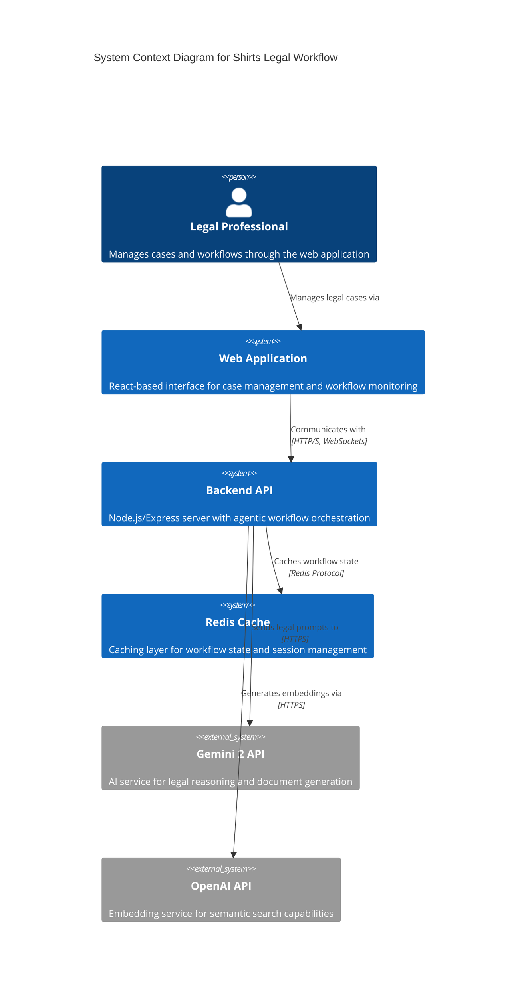
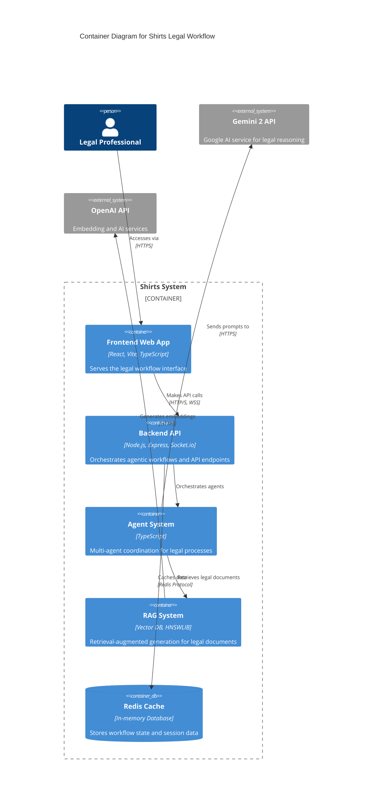

[](https://github.com/gongahkia/shirts/releases/tag/1.0.0)

# `Shirts`

AI Agent-based Legal Workflow Assistant that automates legal processes through intelligent [multi-agent coordination](#architecture) and [RAG](#architecture) technology.

## Stack

* *Frontend*: [React](https://react.dev/), [Vite](https://vite.dev/), [React Query](https://tanstack.com/query/v3), [Framer Motion](https://www.framer.com/motion/), [Headless UI](https://headlessui.com/), [Tailwind CSS](https://tailwindcss.com/), [TypeScript](https://www.typescriptlang.org/)
* *Backend*: [Node.js](https://nodejs.org/en), [Express.js](https://expressjs.com/), [Socket.io](https://socket.io/), [TypeScript](https://www.typescriptlang.org/)
* *AI*: [Gemini 2 API](https://ai.google.dev/), [OpenAI](https://openai.com/), [Vector Database](https://github.com/lancedb/vectordb), [HNSWLIB](https://github.com/nmslib/hnswlib)
* *Document Processing*: [PDF-lib](https://pdf-lib.js.org/), [DOCX](https://docx.js.org/)
* *Caching*: [Redis](https://redis.io/)
* *Package*: [Docker](https://www.docker.com/)

## Usage

The below instructions are for locally hosting `Shirts`.

1. First execute the below.

```console
$ git clone https://github.com/gongahkia/shirts && cd shirts
```

2. Then create a `.env` file at the project root with the following content.

```env
GEMINI_API_KEY="your_gemini_api_key_here"
OPENAI_API_KEY="your_openai_api_key_here"
JWT_SECRET="your_super_secure_jwt_secret_here"
API_RATE_LIMIT=100
POSTGRES_PASSWORD="your_postgres_password_here"
GRAFANA_PASSWORD="your_grafana_admin_password_here"
```

3. Finally run the below.

```console
$ npm install && npm run build
```

4. You can then use any of the following commands to run `Shirts`.

```console
$ npm run dev
$ npm run docker:up
$ docker-compose up --build
```

## Architecture

`Shirts` is structured as a monorepo comprising a sophisticated backend implementing agentic workflows, a React frontend, and advanced AI services for legal document processing.

### System Context Diagram



### Container Diagram



## Support

`Shirts` is designed to work across multiple platforms:

-   **Web Browsers**: Modern browsers supporting ES2020+ features
-   **Desktop**: Via web application in Chrome, Firefox, Safari, Edge
-   **Development**: Node.js 20+, npm 10+, Docker for containerization
-   **Production**: Docker Compose orchestration with Redis caching

For support, please [open an issue](https://github.com/gongahkia/shirts/issues) on GitHub.

## Reference

The name `Shirts` is in reference to the legal drama TV series [Suits](https://suits.fandom.com/wiki/Suits_Wiki), which follows talented college dropout [Mike Ross](https://suits.fandom.com/wiki/Mike_Ross) who starts working as a law associate for [Harvey Specter](https://suits.fandom.com/wiki/Harvey_Specter) despite never attending law school.

## Legal

### Disclaimer

This software is provided "as is" without warranty of any kind, express or implied. The developers make no representations or warranties regarding the accuracy, reliability, or completeness of the software. Users assume all risks associated with the use of this application, including but not limited to data loss, security vulnerabilities, or unintended automation of legal processes.

**Important**: This application is for educational and research purposes. Any legal documents or advice generated should be reviewed by qualified legal professionals before use in actual legal proceedings.
