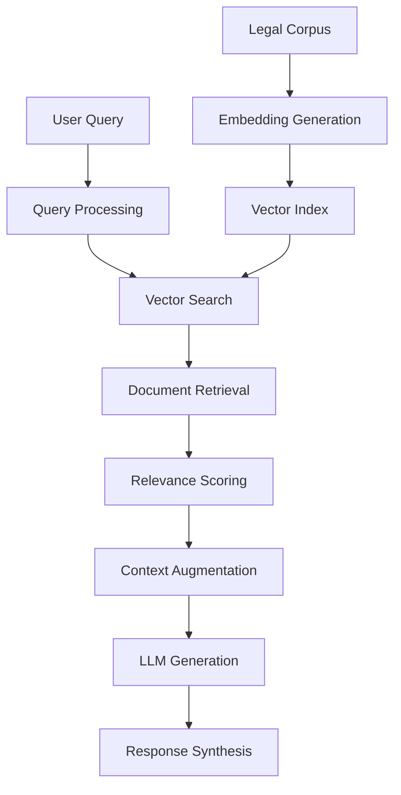
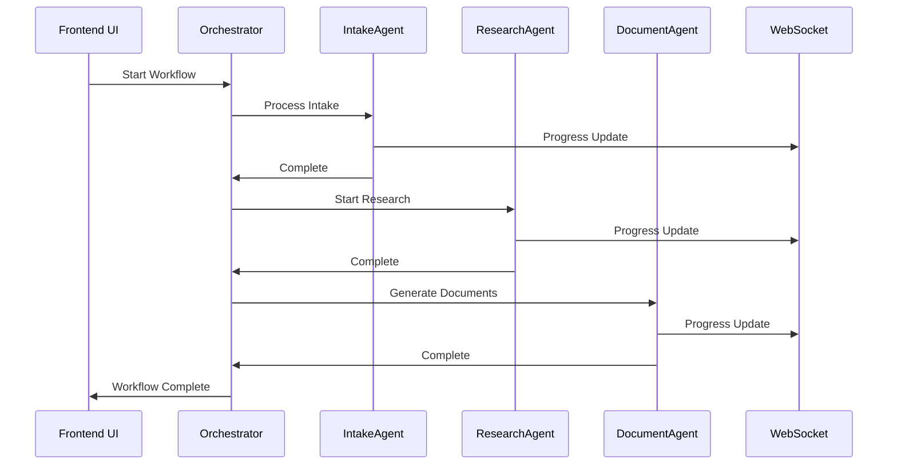

# Shirts Legal Workflow

A sophisticated full-stack web application implementing an AI-powered agentic workflow system for comprehensive legal case management. Built with cutting-edge Retrieval-Augmented Generation (RAG) technology and powered by Gemini 2 API for intelligent legal document processing and workflow automation.

## 🏛️ Project Overview

Shirts Legal Workflow revolutionizes legal practice through intelligent automation, providing end-to-end case management from initial plaintiff intake through document generation and case resolution. The system employs a multi-agent architecture that coordinates distinct legal process stages, combining the power of modern AI with professional legal expertise.

### Key Features

- **🤖 Multi-Agent Workflow System**: Coordinated AI agents handle intake, research, argument generation, document drafting, and review
- **🧠 Gemini 2 Integration**: Advanced natural language processing for legal reasoning and document analysis
- **📚 RAG Pipeline**: Intelligent retrieval system combining vector search with legal corpus knowledge
- **📄 Document Generation**: Automated creation of legal documents in multiple formats (PDF, DOCX, HTML)
- **⚡ Real-time Monitoring**: Live workflow progress tracking with WebSocket connections
- **🎨 Professional UI**: Dark mode legal-focused interface designed for legal professionals
- **🔍 Semantic Search**: Vector-based search across legal precedents and documentation
- **📊 Analytics Dashboard**: Comprehensive case and workflow performance insights

## 🏗️ Architecture

### Backend Architecture
```
📦 Backend (Node.js + TypeScript)
├── 🤖 Agentic Workflow System
│   ├── IntakeAgent - Initial case processing & validation
│   ├── ResearchAgent - Legal research & precedent analysis
│   ├── DocumentAgent - Automated document generation
│   └── WorkflowOrchestrator - Multi-agent coordination
├── 🧠 AI Services
│   ├── GeminiService - Legal reasoning & text generation
│   └── RAGService - Document retrieval & vector search
├── 🛣️ REST API
│   ├── Cases Management
│   ├── Workflow Control
│   ├── Agent Monitoring
│   └── Document Generation
└── 🔌 WebSocket Real-time Updates
```

### Frontend Architecture
```
⚛️ Frontend (React 18 + TypeScript)
├── 🎨 Legal-themed UI Components
├── 📊 Dashboard & Analytics
├── 📱 Responsive Case Management
├── 🔄 Real-time Status Monitoring
└── 🌙 Dark Mode Support
```

## 🚀 Quick Start

### Prerequisites

- **Node.js 20+** - Runtime environment
- **Docker & Docker Compose** - For containerized deployment
- **Gemini API Key** - Required for AI functionality
- **OpenAI API Key** - Optional, for embeddings (can use mock embeddings)

### Option 1: Quick Setup with Scripts

```bash
# Clone and setup the project
git clone <repository-url>
cd shirts
./scripts/setup.sh

# Start development environment
./scripts/dev.sh
```

### Option 2: Manual Setup

```bash
# Install dependencies
npm install
cd backend && npm install && cd ..
cd frontend && npm install && cd ..

# Configure environment
cp .env.example .env
# Edit .env with your API keys

# Start development servers
npm run dev
```

### Option 3: Docker Deployment

```bash
# Configure environment
cp .env.example .env
# Edit .env with your API keys

# Deploy with Docker
docker-compose up --build

# Or use the deployment script
./scripts/deploy.sh
```

## 🔧 Configuration

### Environment Variables

Create a `.env` file in the project root:

```env
# Required API Keys
GEMINI_API_KEY=your_gemini_api_key_here
OPENAI_API_KEY=your_openai_api_key_here  # Optional

# Security
JWT_SECRET=your_super_secure_jwt_secret_here
API_RATE_LIMIT=100

# Optional: Database
POSTGRES_PASSWORD=your_postgres_password_here

# Optional: Monitoring
GRAFANA_PASSWORD=your_grafana_admin_password_here
```

### Getting API Keys

1. **Gemini API Key**: Visit [Google AI Studio](https://aistudio.google.com/)
2. **OpenAI API Key**: Visit [OpenAI Platform](https://platform.openai.com/) (optional, for embeddings)

## 🎯 Usage Guide

### Creating a Legal Case

1. **Navigate to Cases** → **New Case**
2. **Fill Plaintiff Information**:
   - Personal details and contact information
   - Legal issue description
   - Desired outcome and urgency level
3. **Configure Case Details**:
   - Case title and legal category
   - Jurisdiction and court level
   - Complexity and estimated duration
4. **Submit** to automatically start the AI workflow

### Monitoring Workflow Progress

1. **Dashboard Overview**: Real-time system status and case statistics
2. **Workflow Detail View**: Stage-by-stage progress tracking
3. **Live Updates**: WebSocket-powered real-time notifications
4. **Agent Status**: Monitor AI agent health and performance

### Document Management

- **Automatic Generation**: Documents created at each workflow stage
- **Multiple Formats**: PDF, DOCX, HTML output supported
- **Professional Templates**: Court-ready legal document formatting
- **Version Control**: Track document revisions and approvals

## 🔍 API Documentation

### Core Endpoints

```typescript
// Cases Management
POST   /api/cases              // Create new case
GET    /api/cases              // List cases (paginated)
GET    /api/cases/:id          // Get case details
PUT    /api/cases/:id          // Update case
DELETE /api/cases/:id          // Delete case
GET    /api/cases/:id/documents // Get case documents

// Workflow Control
GET    /api/workflows          // List active workflows
GET    /api/workflows/:id      // Get workflow details
POST   /api/workflows/:id/pause // Pause workflow
POST   /api/workflows/:id/cancel // Cancel workflow
GET    /api/workflows/:id/logs  // Get workflow logs

// Agent Monitoring
GET    /api/agents             // List all agents
GET    /api/agents/health      // System health status

// RAG System
POST   /api/rag/query          // Search legal documents
POST   /api/rag/documents      // Add document to index
GET    /api/rag/stats          // RAG system statistics
```

### WebSocket Events

```typescript
// Workflow Events
'workflow-started'              // New workflow initiated
'workflow-progress'             // Progress updates
'workflow-stage-completed'      // Stage completion
'workflow-completed'            // Full workflow done
'workflow-failed'              // Workflow errors

// Agent Events
'agent-processing-started'      // Agent begins work
'agent-processing-completed'    // Agent finishes task
'agent-progress-update'         // Detailed progress info
```

## 🧪 Testing

### Running Tests

```bash
# Run all tests
npm test

# Backend tests only
npm run test:backend

# Frontend tests only
npm run test:frontend

# Test coverage
npm run test:coverage
```

### Test Structure

```
backend/src/test/
├── agents/           # Agent behavior tests
├── routes/           # API endpoint tests
├── services/         # Service layer tests
└── mocks/           # Mock implementations

frontend/src/test/
├── components/       # Component unit tests
├── pages/           # Page integration tests
├── hooks/           # Custom hook tests
└── mocks/           # API and service mocks
```

## 🔄 Agentic Workflow Details

### Workflow Stages

1. **Plaintiff Intake** (IntakeAgent)
   - Validates plaintiff information
   - Categorizes legal issues
   - Assesses case urgency and complexity

2. **Legal Research** (ResearchAgent)
   - RAG-powered precedent search
   - Statute and regulation analysis
   - Case law relevance scoring

3. **Argument Generation** (ResearchAgent)
   - AI-powered legal reasoning
   - Structured argument formulation
   - Evidence and precedent integration

4. **Document Drafting** (DocumentAgent)
   - Template-based document creation
   - Multi-format output generation
   - Professional legal formatting

5. **Review & Revision** (DocumentAgent)
   - Document quality validation
   - Compliance checking
   - Revision recommendations

6. **Final Formatting** (DocumentAgent)
   - Court-ready document preparation
   - Final quality assurance
   - Delivery formatting

### RAG System Architecture



### Agent Communication Flow



## 🚢 Deployment

### Production Deployment

```bash
# Using Docker Compose (Recommended)
./scripts/deploy.sh

# Manual deployment
docker-compose -f docker-compose.yml up -d
```

### Scaling Considerations

- **Horizontal Scaling**: Multiple backend instances behind load balancer
- **Database**: PostgreSQL for production (replace in-memory storage)
- **Caching**: Redis for session and workflow state management
- **Monitoring**: Prometheus + Grafana stack (optional services included)
- **Search**: Elasticsearch for advanced document search (optional)

### Infrastructure Requirements

- **Minimum**: 2 CPU cores, 4GB RAM, 10GB storage
- **Recommended**: 4 CPU cores, 8GB RAM, 50GB storage
- **Enterprise**: 8+ CPU cores, 16GB+ RAM, 100GB+ storage

## 🔧 Development

### Project Structure

```
shirts/
├── backend/                 # Node.js + TypeScript backend
│   ├── src/
│   │   ├── agents/         # AI workflow agents
│   │   ├── services/       # Business logic services
│   │   ├── routes/         # API route handlers
│   │   ├── middleware/     # Express middleware
│   │   ├── utils/          # Utility functions
│   │   └── types/          # TypeScript definitions
│   ├── test/               # Backend tests
│   └── dist/               # Compiled JavaScript
├── frontend/               # React + TypeScript frontend
│   ├── src/
│   │   ├── components/     # Reusable UI components
│   │   ├── pages/          # Page components
│   │   ├── hooks/          # Custom React hooks
│   │   ├── services/       # API and external services
│   │   └── types/          # TypeScript definitions
│   ├── test/               # Frontend tests
│   └── dist/               # Built static files
├── scripts/                # Deployment and utility scripts
├── docker-compose.yml      # Multi-container orchestration
└── README2.md             # This documentation
```

### Adding New Features

1. **New Agent**: Extend `BaseAgent` class in `backend/src/agents/`
2. **API Endpoint**: Add route in `backend/src/routes/`
3. **UI Component**: Create in `frontend/src/components/`
4. **Database Model**: Define in `backend/src/types/`

### Code Quality

```bash
# Linting
npm run lint
npm run lint:fix

# Type checking
npm run typecheck

# Formatting
npm run format
```

## 📊 Monitoring & Analytics

### Built-in Monitoring

- **Agent Health**: Real-time agent status and performance metrics
- **Workflow Analytics**: Success rates, processing times, error tracking
- **System Metrics**: API response times, error rates, uptime
- **Resource Usage**: Memory, CPU, storage utilization

### Optional Monitoring Stack

Enable Prometheus + Grafana for advanced monitoring:

```bash
# Uncomment monitoring services in docker-compose.yml
docker-compose up prometheus grafana
```

Access at:
- Prometheus: http://localhost:9090
- Grafana: http://localhost:3001 (admin/admin)

## 🔒 Security

### Security Features

- **Authentication**: JWT-based session management
- **Rate Limiting**: Configurable API rate limits
- **Input Validation**: Comprehensive request validation
- **CORS Protection**: Cross-origin request security
- **Secure Headers**: Security-focused HTTP headers
- **Data Encryption**: Encrypted data at rest and in transit

### Security Best Practices

1. **Environment Variables**: Never commit API keys to version control
2. **HTTPS**: Use SSL certificates in production
3. **Database Security**: Use strong passwords and restricted access
4. **Regular Updates**: Keep dependencies updated
5. **Monitoring**: Track unusual activity and access patterns

## 🐛 Troubleshooting

### Common Issues

**❌ "Gemini API Key Invalid"**
```bash
# Verify your API key is correctly set
echo $GEMINI_API_KEY
# Check Google AI Studio for key validity
```

**❌ "Cannot connect to Redis"**
```bash
# Check Redis container status
docker-compose ps redis
# Restart Redis if needed
docker-compose restart redis
```

**❌ "Frontend not loading"**
```bash
# Check if backend is running
curl http://localhost:3001/health
# Check frontend build
cd frontend && npm run build
```

**❌ "WebSocket connection failed"**
```bash
# Verify CORS configuration
# Check firewall settings for port 3001
# Ensure WebSocket upgrade headers are allowed
```

### Debug Mode

```bash
# Enable debug logging
export LOG_LEVEL=debug
npm run dev

# Or with Docker
LOG_LEVEL=debug docker-compose up
```

### Performance Optimization

1. **Database Indexing**: Add indexes for frequently queried fields
2. **Caching**: Implement Redis caching for API responses
3. **CDN**: Use CDN for static asset delivery
4. **Compression**: Enable gzip compression for API responses
5. **Connection Pooling**: Configure database connection pools

## 🤝 Contributing

### Development Workflow

1. **Fork** the repository
2. **Create** feature branch: `git checkout -b feature/amazing-feature`
3. **Implement** changes with tests
4. **Lint** and **test**: `npm run lint && npm test`
5. **Commit** changes: `git commit -m 'Add amazing feature'`
6. **Push** branch: `git push origin feature/amazing-feature`
7. **Create** Pull Request

### Code Standards

- **TypeScript**: Strict type checking enabled
- **ESLint**: Airbnb configuration with legal-specific rules
- **Prettier**: Consistent code formatting
- **Testing**: Minimum 80% code coverage
- **Documentation**: JSDoc comments for all public APIs

## 📈 Roadmap

### Upcoming Features

- [ ] **Multi-tenant Support**: Organization and user management
- [ ] **Advanced Analytics**: ML-powered case outcome prediction
- [ ] **Integration APIs**: Connect with popular legal software
- [ ] **Mobile App**: Native iOS/Android applications
- [ ] **Voice Integration**: Voice-to-text case intake
- [ ] **Blockchain**: Immutable document versioning
- [ ] **AI Training**: Custom model fine-tuning for specific jurisdictions

### Performance Enhancements

- [ ] **Microservices**: Split backend into specialized services
- [ ] **GraphQL**: More efficient data fetching
- [ ] **Edge Computing**: Distributed AI processing
- [ ] **Advanced Caching**: Multi-layer caching strategy

## 📜 License

This project is licensed under the MIT License - see the [LICENSE](LICENSE) file for details.

## 🙏 Acknowledgments

- **Google AI**: Gemini 2 API for advanced language processing
- **OpenAI**: Embedding models for semantic search
- **Legal Community**: Inspiration and domain expertise
- **Open Source**: Built on the shoulders of giants

## 📞 Support

### Getting Help

- **Documentation**: Check this README and inline code comments
- **Issues**: Create GitHub issues for bugs and feature requests
- **Discussions**: Use GitHub Discussions for questions and ideas
- **Community**: Join our Discord server for real-time help

### Commercial Support

For enterprise deployments and custom development:
- Email: support@shirts-legal.com
- Website: https://shirts-legal.com
- Phone: +1-800-SHIRTS-LAW

---

**Made with ⚖️ and 🤖 by the Shirts Legal Workflow Team**

*Revolutionizing legal practice through intelligent automation*